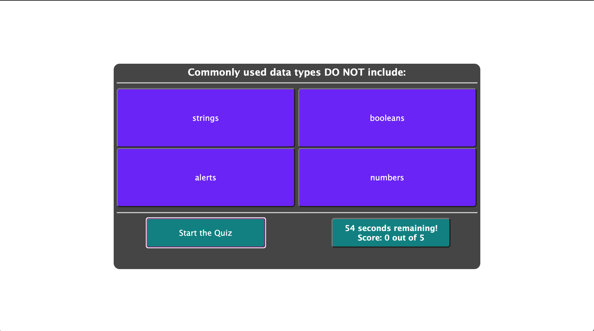
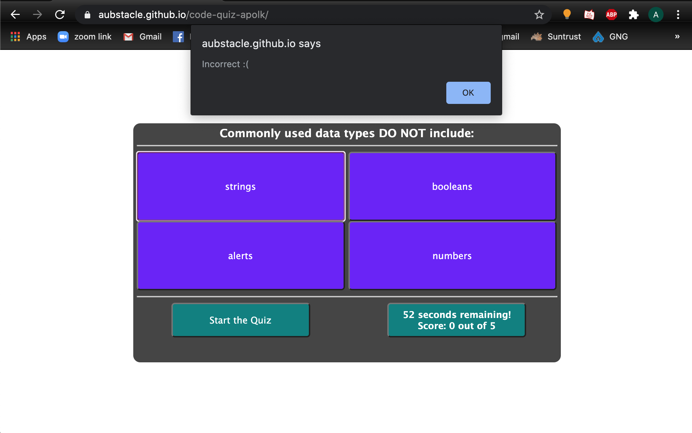
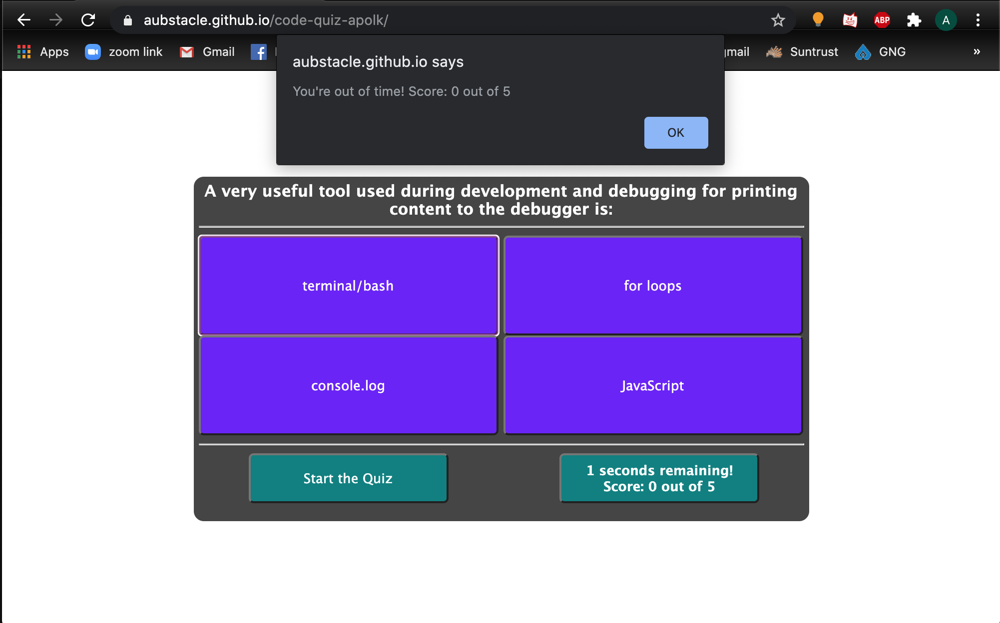

# JavaScript Code Quiz

## Description
Welcome to my Javascript Code Quiz!! I was asked to create a multiple choice coding quiz with the following acceptance criteria:

GIVEN I am taking a code quiz
WHEN I click the start button
THEN a timer starts and I am presented with a question
WHEN I answer a question
THEN I am presented with another question
WHEN I answer a question incorrectly
THEN time is subtracted from the clock
WHEN all questions are answered or the timer reaches 0
THEN the game is over
WHEN the game is over
THEN I can save my initials and score

Unfortunately I couldn't fully get the local storage score saving functionality to fully work without breaking the rest of the application, so it is not included currently.

deployed application: https://aubstacle.github.io/code-quiz-apolk/.

Huge shoutout to the youtuber Web Dev Simplified for his instructional video on building multiple choice quizzes for Javascript (https://www.youtube.com/watch?v=riDzcEQbX6k&list=WL&index=2&t=0s). It really helped me get started with the HTML and CSS, and also helped me start grasping the way the functions should be declared.

## Screenshots

### Starting point:

### First question

### Correct answer prompt

### Incorrect answer prompt

### Upon finishing all questions

### If you run out of time

## Usage

Everything you need to run this application is located in this github repo: https://github.com/aubstacle/code-quiz-apolk/
(Includes html, css, js)

## License

MIT License

Copyright (c) 2020 Aubrey Polk

Permission is hereby granted, free of charge, to any person obtaining a copy of this software and associated documentation files (the "Software"), to deal in the Software without restriction, including without limitation the rights to use, copy, modify, merge, publish, distribute, sublicense, and/or sell copies of the Software, and to permit persons to whom the Software is furnished to do so, subject to the following conditions:

The above copyright notice and this permission notice shall be included in all copies or substantial portions of the Software.

THE SOFTWARE IS PROVIDED "AS IS", WITHOUT WARRANTY OF ANY KIND, EXPRESS OR IMPLIED, INCLUDING BUT NOT LIMITED TO THE WARRANTIES OF MERCHANTABILITY, FITNESS FOR A PARTICULAR PURPOSE AND NONINFRINGEMENT. IN NO EVENT SHALL THE AUTHORS OR COPYRIGHT HOLDERS BE LIABLE FOR ANY CLAIM, DAMAGES OR OTHER LIABILITY, WHETHER IN AN ACTION OF CONTRACT, TORT OR OTHERWISE, ARISING FROM, OUT OF OR IN CONNECTION WITH THE SOFTWARE OR THE USE OR OTHER DEALINGS IN THE SOFTWARE.

